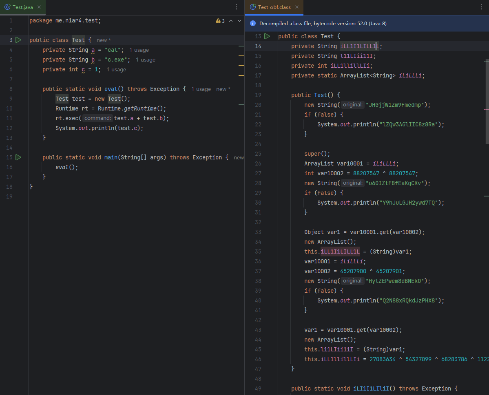
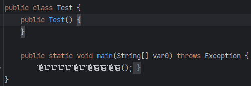
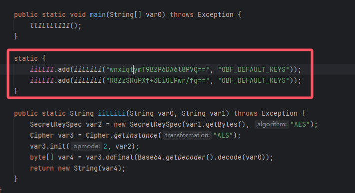
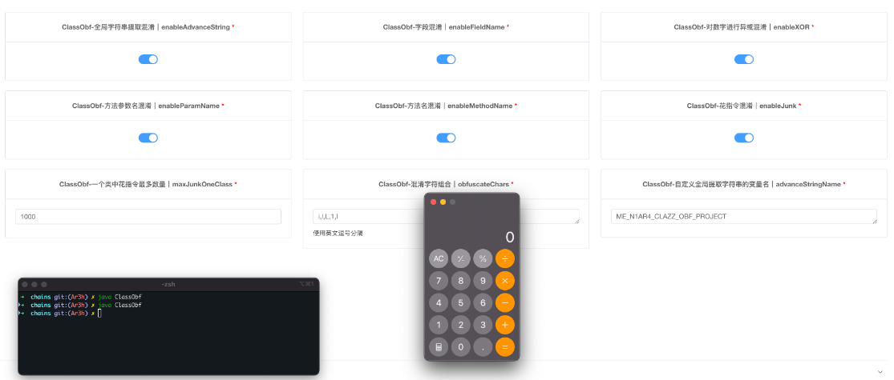
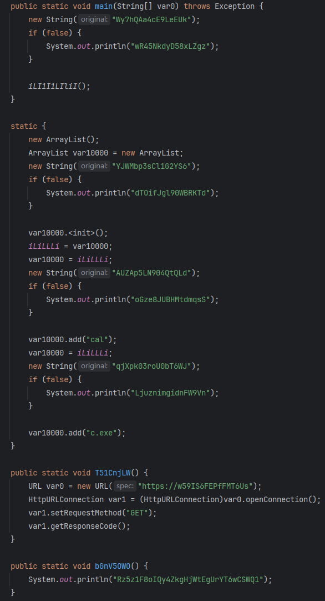
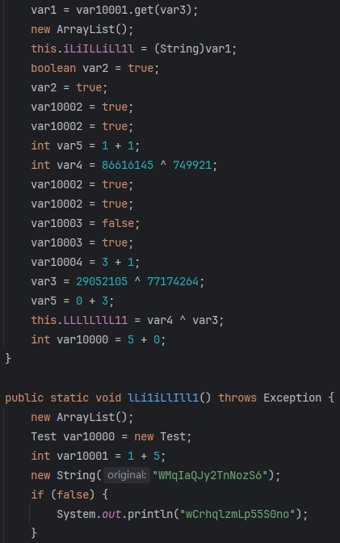
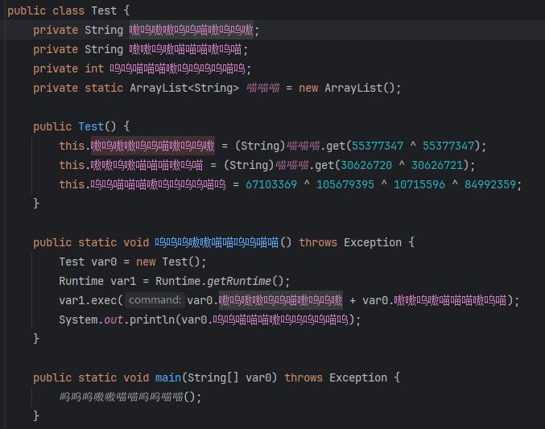
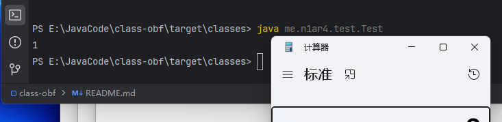

# class-obf

[CHANGE LOG](CHANGELOG.MD)


`class-obf` 项目全称 `Class Obfuscator` 项目，专门用来混淆单个 `Class` 文件

示例图：混淆前 -> 混淆后



可以自定义中文混淆字符，以及方法隐藏等技巧



从 `1.2.0` 版本开始支持集中提取字符串后 `AES` 加密运行时解密



本项目已深度集成到 `web-chains` 项目中 (https://github.com/Java-Chains/web-chains)



## 背景

`jar-analyzer` 系列曾有一款工具 `jar-obfuscator` 实现 `jar` 包的混淆

链接：https://github.com/jar-analyzer/jar-obfuscator

但是该工具有以下问题：

- 配置文件非常复杂，不熟悉的情况下难以上手使用
- 不同的 `Jar` 文件需要考虑各种不同的情况否则无法启动
- 实际需求更大的是对单个 `Class` 文件的混淆（内存马等需求）

**于是有了这款工具**

- 配置大幅简化，仅针对单个 `Class` 文件
- 命令行输出改善，详细展示混淆细节
- 你可以只混淆你项目的核心类替换即可（方便快速）
- 提供了多种方式的 `API` 调用

## 快速开始

生成配置文件：`java -jar class-obf.jar --generate`

使用指定配置文件混淆当前目录的 `Test.class` 

```shell
java -jar class-obf.jar --config config.yaml --input Test.class
```

一个普通的类

```java
public class Test {
    private String a = "cal";
    private String b = "c.exe";
    private int c = 1;

    public static void eval() throws Exception {
        Test test = new Test();
        Runtime rt = Runtime.getRuntime();
        rt.exec(test.a + test.b);
        System.out.println(test.c);
    }

    public static void main(String[] args) throws Exception {
        eval();
    }
}
```

你可以随意搭配配置文件，得到以下几种混淆结果

效果一（默认配置）



效果二（使用最高级别的花指令参数）



自定义混淆字符（例如使用中文）



开启隐藏方法和字段功能（反编译看不到方法）


但是！可以成功执行



## API

你可以使用代码方式调用（参考 `test` 目录的 `TestQuick/TestAPI` 文件）

可以使用 `jitpack` 或者自行下载后添加到 `classpath`

```xml
<!-- 添加仓库 -->
<repositories>
    <repository>
        <id>jitpack.io</id>
        <url>https://jitpack.io</url>
    </repository>
</repositories>
<!-- 引入项目 -->
<dependencies>
    <dependency>
        <groupId>com.github.jar-analyzer</groupId>
        <artifactId>class-obf</artifactId>
        <version>1.3.1</version>
    </dependency>
</dependencies>
```

最快速使用（使用默认配置输入文件返回 `base64` 字节码）

```java
String data = ClassObf.quickRun("Test.class");
System.out.println(data);
```

自行进行配置进阶写法

```java
BaseConfig config = new BaseConfig();
// 省略代码 自行设置 config 文件

ClassObf classObf = new ClassObf(config);
// 支持三种重载：输入文件字符串，输入文件 PATH 对象，输入 byte[] 数据
Result result = classObf.run("Test.class");
if (result.getMessage().equals(Result.SUCCESS)) {
    // result.getData() 即可得到混淆后的 byte[] 字节码
    System.out.println(Base64.getEncoder().encodeToString(result.getData()));
}
```

**注意：由于设计原因，以上代码不支持并发**

## 配置文件

可以根据你的需求修改配置文件

```yaml
!!me.n1ar4.clazz.obfuscator.config.BaseConfig
# 日志级别
logLevel: info
# 是否使用安静模式（不打印调试信息）
quiet: false
# 是否启动 JAVA ASM 的 COMPUTE FRAMES/MAX 自动计算
# 如果遇到 TYPE * NOT PRESENT 报错可以尝试设置该选项为 FALSE
asmAutoCompute: true

# 混淆字符组合
# 建议使用长度大于等于 5 否则可能有预期外的 BUG
obfuscateChars:
  - "i"
  - "l"
  - "L"
  - "1"
  - "I"

# 是否开启删除编译信息
enableDeleteCompileInfo: true

# 是否开启方法名混淆
# 这里会自动修改方法之间的引用
enableMethodName: true
# 一般 public 方法是被外部调用的
# 可以设置该选项为 true 来跳过 public 方法混淆
ignorePublic: false
# 全局方法黑名单
# 该方法不会进行混淆 引用也不会被修改
methodBlackList:
  - "main"

# 是否开启字段混淆
enableFieldName: true
# 是否开启方法参数名混淆
# 由于反编译器 可能显示的结果只是 var0 var1 等
enableParamName: true
# 是否对数字进行异或混淆
enableXOR: true

# 对所有字符串进行 AES 加密
enableAES: true
# 默认 AES KEY 注意长度必须是 16
aesKey: OBF_DEFAULT_KEYS
# AES 解密方法名
aesDecName: iiLLiLi
# AES KEY 字段名
aesKeyField: iiiLLLi1i

# 是否启用全局字符串提取混淆
enableAdvanceString: true
# 全局提取字符串的变量名可以自定义
advanceStringName: ME_N1AR4_CLAZZ_OBF_PROJECT

# 是否开启花指令混淆
enableJunk: true
# 花指令混淆级别 1-5
junkLevel: 3
# 一个类中花指令最多数量
maxJunkOneClass: 1000

# 是否开启字段隐藏
# 可以防止大部分 IDEA 版本反编译
enableHideField: false
# 是否开启方法隐藏
# 可以防止大部分 IDEA 版本反编译
enableHideMethod: false

```

## Thanks


This project is developed using JetBrains IDEA.
Thanks to JetBrains for providing me with a free license, which is a strong support for me.

## Star

<div align="center">


</div>
